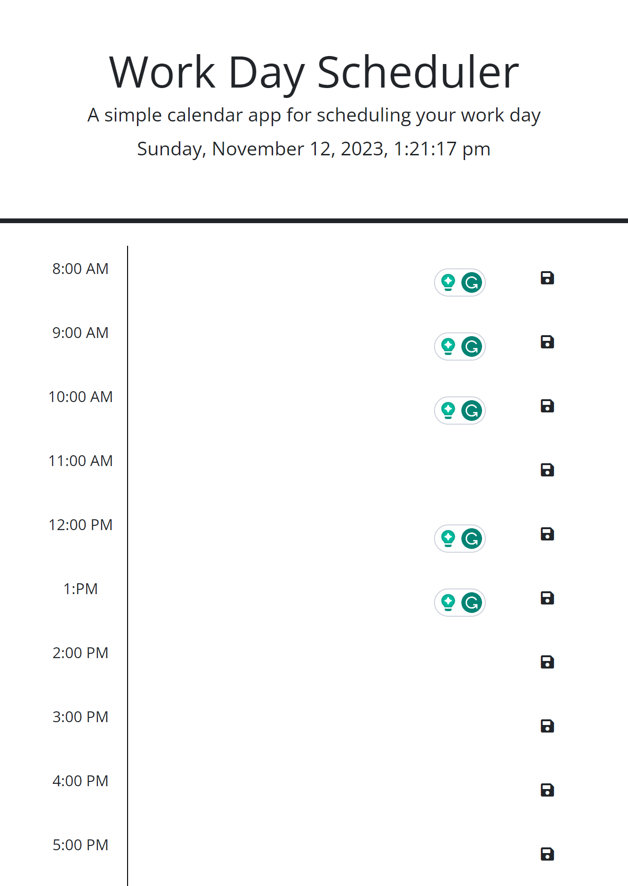

# Work Day Schedule - Third-Party APIs

## Description

This application is simple calendar that allow the user with a busy schedule to use as planner. User can use this applocation to effectively manage important daily events. User can save daily events starting from 9am to 5pm of working day.

## Screenshot

## License

MIT

## Questions

For questions, please refer to the GitHub information listed below

## Contributors

Blessing Babarinde github.com/blessingBab
